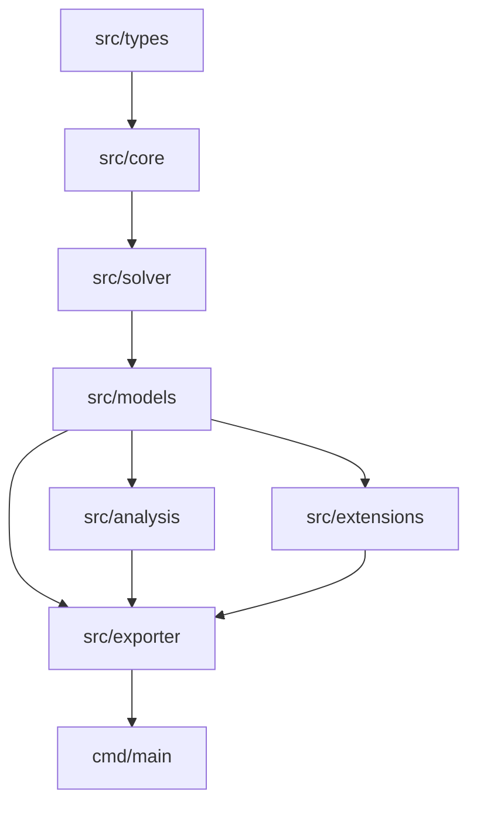

# MoonBit Marine Biogeochemical Box Model Engine (`moonbit-biogeochem`)

[](https://github.com/lqlnvj/moonbit-biogeochem/actions/workflows/ci.yml)
[](LICENSE)
[](https://www.moonbitlang.com)

`moonbit-biogeochem` is a configurable biogeochemical box model engine written in native MoonBit for marine ecosystem simulation, ocean carbon cycle modeling, dissolved oxygen dynamics, and stoichiometric mass-balance auditing.

---

## Key Features

- **Ecological & Geochemical Models**: Built-in modules for NPZD (4-compartment), NPZD+D (6-compartment fast/slow detritus), oxygen depletion (DO/BOD), ocean carbonate chemistry (DIC, TA, pCO₂), Diatom-Silicon competition, iron limitation (HNLC), and microbial loop dynamics.
- **Numerical Integrators**: Support for Forward Euler, stiff Implicit Euler, Trapezoidal predictor-corrector, multi-step Adams-Bashforth (`AB2`/`AB3`), classic 4th-order Runge-Kutta (`RK4`), and adaptive step-size `RKF45` (Dormand-Prince) solvers.
- **Stoichiometry & Diagnostics**: Redfield ratio auditing (C:N:P:O₂ = 106:16:1:-138), multi-element matrix transformations (C-N-P-Si-O₂), and physical unit consistency checks.
- **Sensitivity & Uncertainty Analysis**: 1D parameter grid sweeps, local finite-difference sensitivity matrices, global Sobol variance-based sensitivity indices, Monte Carlo samplers, and Martin curve carbon pump diagnostics.
- **Grid Extensions & Assimilation**: 1D vertical water column grid (`WaterColumn1D`), advection-diffusion-reaction solver, sediment diagenesis benthic fluxes, Nudge and Ensemble Kalman Filter (`EnKF`) data assimilation interfaces, and declarative DSL builders.
- **Data Export & Visualizers**: Export to CSV, JSON, Markdown reports, JUnit XML, ASCII line plots, heatmaps, and Mermaid diagrams.

---

## Architecture



---

## Package Structure

| Package | Purpose |
| :--- | :--- |
| `src/types` | Physical units, state vectors, parameters, spectral light attenuation, and environmental forcing. |
| `src/core` | Reaction kinetics, Redfield stoichiometry, air-sea gas transfer, and seawater thermodynamics. |
| `src/solver` | ODE numerical solvers (Euler, Implicit Euler, AB2/AB3, RK4, RKF45) with error control. |
| `src/models` | NPZD, NPZD+D, oxygen depletion, ocean carbonate chemistry, iron limitation, and microbial loop models. |
| `src/analysis` | Parameter sweeps, local/Sobol sensitivity analysis, Monte Carlo UQ, and carbon pump metrics. |
| `src/extensions` | 1D vertical column, sediment diagenesis, EnKF data assimilation, and DSL builder. |
| `src/exporter` | CSV/JSON serialization, Markdown & JUnit XML reporters, ASCII visualizers, and Mermaid export. |

---

## Quick Start

### 1. Run the CLI Demo

```bash
moon run cmd/main
```

### 2. Integration Example (RK4 Solver)

```moonbit
let model = @models.create_npzd_model(15.0, 0.5, 0.1, 0.2)
let env_fn = fn(t) { @types.EnvironmentForcing::seasonal_forcing(t, 45.0) }
let traj = @solver.solve_rk4(model, 30.0, 0.5, env_fn).unwrap()
let series = traj.get_time_series("P").unwrap()
let plot = @exporter.render_ascii_plot(series, "Phytoplankton (mmol N/m^3)", 30, 6)
println(plot)
```

### 3. Adaptive Step-Size Simulation

```moonbit
let model = @models.create_coupled_carbon_npzd_model(12.0, 0.8, 0.2, 0.1, 240.0, 2100.0, 2300.0)
let cfg = @solver.AdaptiveSolverConfig::default()
let traj = @solver.solve_rk45(model, 20.0, 0.5, cfg, env_fn).unwrap()
let csv_data = @exporter.export_trajectory_csv(traj)
```

---

## Development & Testing

```bash
# Type check project
moon check

# Run tests
moon test

# Format code
moon fmt

# Update interface info
moon info
```

---

## License

This project is licensed under the Apache License 2.0. See [LICENSE](LICENSE) for details.
