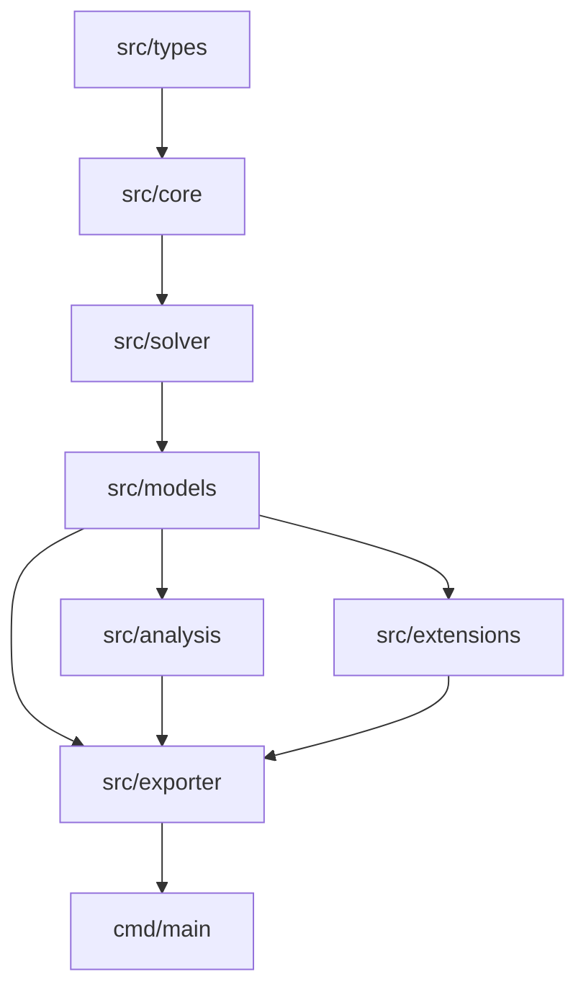

# MoonBit Marine Biogeochemical Box Model Engine

[](https://github.com/lqlnvj/moonbit-biogeochem/actions/workflows/ci.yml)
[](LICENSE)

`moonbit-biogeochem` is a configurable marine biogeochemical simulation engine written in MoonBit. It provides reusable state and forcing types, reaction and carbonate chemistry utilities, ODE solvers, ecological model families, diagnostics, grid extensions, data-assimilation interfaces, and report exporters.

## Capabilities

- Ecological and geochemical models: NPZD, NPZD+D, oxygen depletion, carbonate chemistry, iron limitation, diatom–silicon competition, and microbial-loop dynamics.
- Numerical integration: Forward Euler, implicit Euler, trapezoidal predictor–corrector, Adams–Bashforth 2/3, RK4, and adaptive RKF45.
- Diagnostics: trajectory validation, time-series statistics, threshold crossings, duration metrics, scenario validation, Redfield audits, and water-column stability checks.
- Sensitivity and uncertainty analysis: parameter sweeps, finite-difference sensitivity, Sobol indices, Monte Carlo sampling, and carbon-pump metrics.
- Extensions: one-dimensional vertical water columns, advection–diffusion–reaction stepping, sediment diagenesis, nudging, EnKF interfaces, and declarative builders.
- Export and presentation: CSV, JSON, Markdown, JUnit XML, ASCII plots, heatmaps, and Mermaid diagrams.

## Architecture



## Repository layout

| Path | Purpose |
| :--- | :--- |
| `src/types` | Physical units, state vectors, parameters, light attenuation, and environmental forcing. |
| `src/core` | Reaction kinetics, Redfield stoichiometry, gas transfer, and seawater thermodynamics. |
| `src/solver` | ODE solvers, adaptive stepping, and trajectory integrity validation. |
| `src/models` | Ecological, oxygen, carbonate, iron, silicon, and microbial-loop model families. |
| `src/analysis` | Sweeps, sensitivity, uncertainty quantification, trajectory metrics, and scenario checks. |
| `src/extensions` | Water-column transport, sediment processes, assimilation interfaces, and builders. |
| `src/exporter` | Serializers, reports, plots, and diagram exporters. |
| `cmd/main` | Interactive demonstration of the main simulation workflow. |
| `cmd/benchmark` | Deterministic native workloads used for repeatable performance measurements. |
| `scripts` | Source accounting and benchmark runners. |

## Quick start

Install the current MoonBit toolchain with the [official installer](https://docs.moonbitlang.com/en/latest/tutorial/tour.html), then run:

```bash
moon check
moon test
moon run cmd/main --target native --release
```

### Library example

```moonbit
let model = @models.create_npzd_model(15.0, 0.5, 0.1, 0.2)
let env_fn = fn(t) { @types.EnvironmentForcing::seasonal_forcing(t, 45.0) }
let trajectory = @solver.solve_rk4(model, 30.0, 0.5, env_fn).unwrap()
let series = trajectory.get_time_series("P").unwrap()
let plot = @exporter.render_ascii_plot(series, "Phytoplankton (mmol N/m^3)", 30, 6)
println(plot)
```

### Validation and diagnostics

Trajectories, model scenarios, and vertical columns expose checked entry points for dimensions, finite values, monotonic time, physical bounds, and transport stability. These checks are useful at data-ingestion boundaries and before expensive simulations.

```moonbit
let validation = trajectory.validate()
let summary = @analysis.summarize_trajectory(trajectory).unwrap()
println(summary.duration.to_string())
```

## Benchmarking and source accounting

The benchmark is deterministic and runs native NPZD and coupled-carbon workloads. Use the PowerShell helper to collect repeated wall-clock measurements and retain the raw output:

```powershell
pwsh -NoProfile -File scripts/run-benchmark.ps1 -Runs 5
```

The checked-in [benchmark report](benchmarks/results.md) records the toolchain, platform, workload outputs, and five-run timing summary. It is a reference measurement rather than a cross-machine performance guarantee.

Source accounting is reproducible and excludes `_build` artifacts. Production and test files are counted separately:

```powershell
pwsh -NoProfile -File scripts/measure-source.ps1
```

At this revision the command reports 5,330 production MoonBit lines and 1,132 test lines. The command should be used for later revisions instead of relying on a stale badge or manual estimate.

## Development and testing

MoonBit package interfaces are generated by the toolchain; do not edit `pkg.generated.mbti` files by hand.

```bash
moon fmt
moon info
moon check --target all --deny-warn
moon test --target all --deny-warn
moon fmt --check
```

Coverage can be collected locally with:

```bash
moon test --enable-coverage
moon coverage report -f summary
moon coverage analyze
```

Pull requests are checked on Ubuntu, macOS, and Windows. CI installs MoonBit through the official stable-channel installers, checks all supported targets, runs the full test suite, and verifies generated interface information.

## Contributing

Keep each package focused, place black-box tests in files ending with `_test.mbt`, and use `_wbtest.mbt` for white-box tests. Format changes with `moon fmt`, refresh interfaces with `moon info`, and include a focused regression test for behavior changes. See [CONTRIBUTING.md](CONTRIBUTING.md) for repository conventions.

## License

This project is licensed under the Apache License 2.0. See [LICENSE](LICENSE) for details.
