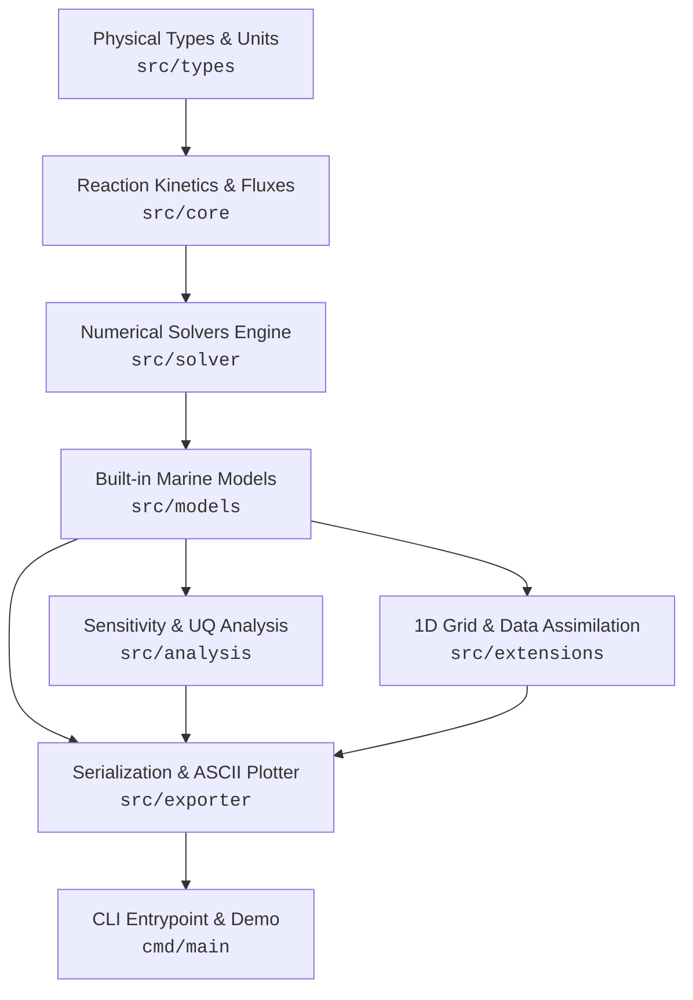

# MoonBit Marine Biogeochemical Box Model Engine (`moonbit-biogeochem`)

[](https://github.com/lqlnvj/moonbit-biogeochem/actions/workflows/ci.yml)
[](LICENSE)
[](https://www.moonbitlang.com)
[](https://github.com/lqlnvj/moonbit-biogeochem)
[](https://github.com/lqlnvj/moonbit-biogeochem)

**`moonbit-biogeochem`** is a configurable, high-performance marine biogeochemical box model engine written in native MoonBit for ocean ecosystem simulations, carbon cycle modeling, oxygen depletion dynamics, and stoichiometric mass-balance analysis.

---

## Key Features

- **Composable Ecosystem Models**: Native implementations of standard NPZD (4-compartment), NPZD+D (6-compartment fast/slow detritus), Oxygen Depletion (DO/BOD), Ocean Carbonate System (DIC, TA, pCO₂), Diatom-Silicon competition, Iron-limitation (HNLC), and Microbial Loop models.
- **Suite of Numerical Solvers**: Flexible ODE numerical integrators including Forward Euler, Stiff Implicit Euler, Trapezoidal Predictor-Corrector, Multi-step Adams-Bashforth (`AB2`/`AB3`), Classic 4th-Order Runge-Kutta (`RK4`), and Adaptive Step-Size `RKF45` (Dormand-Prince) solvers.
- **Stoichiometry & Mass Conservation**: Strict Redfield ratio auditing (C:N:P:O₂ = 106:16:1:-138), multi-element matrix transformations (C-N-P-Si-O₂), and physical unit dimension checks.
- **Sensitivity & Uncertainty Quantification**: Built-in 1D parameter grid sweepers, local finite-difference sensitivity matrices, global Sobol variance-based sensitivity indices, Monte Carlo UQ samplers, and Martin curve carbon pump diagnostics.
- **High-Order Extensions**: 1D vertical water column grid (`WaterColumn1D`), advection-diffusion-reaction solver, sediment diagenesis benthic fluxes, Nudge and Ensemble Kalman Filter (`EnKF`) data assimilation interfaces, and declarative DSL model builders.
- **Data Export & Terminal Visualizers**: Full support for CSV time-series exports, JSON model configuration serialization, Markdown scientific report generators, JUnit XML CI reporters, ASCII line/heatmap renderers, and Mermaid diagram exporters.

---

## Architecture & Module Topology



---

## Package Overview

| Package | Description | Key Modules |
| :--- | :--- | :--- |
| **`src/types`** | Units, state vectors, parameters, spectral light & environmental forcing | `unit.mbt`, `state.mbt`, `parameter.mbt`, `unit_converter.mbt`, `environment.mbt` |
| **`src/core`** | Kinetics, Redfield stoichiometry, air-sea gas transfer & thermodynamics | `flux.mbt`, `stoichiometry.mbt`, `reaction_kinetics.mbt`, `thermodynamics.mbt`, `boundary.mbt` |
| **`src/solver`** | ODE numerical integrators with error & step-size controllers | `euler.mbt`, `implicit_euler.mbt`, `trapezoidal.mbt`, `adams_bashforth.mbt`, `rk4.mbt`, `rk45.mbt` |
| **`src/models`** | Ocean ecosystem, hypoxia, carbonate chemistry & microbial loop models | `npzd.mbt`, `npzdd.mbt`, `oxygen.mbt`, `carbon.mbt`, `coupled_carbon_npzd.mbt`, `npzd_silicon.mbt` |
| **`src/analysis`** | Grid sweeps, Sobol & local sensitivity, Monte Carlo UQ & carbon pump metrics | `sweep.mbt`, `sensitivity.mbt`, `sobol_sensitivity.mbt`, `monte_carlo.mbt`, `diagnostics.mbt` |
| **`src/extensions`**| 1D vertical column, sediment diagenesis, EnKF data assimilation & DSL builder | `column1d.mbt`, `column1d_advection.mbt`, `sediment.mbt`, `ensemble_kalman.mbt`, `builder.mbt` |
| **`src/exporter`** | CSV/JSON serialization, Markdown & JUnit XML reports, ASCII visualizers | `csv.mbt`, `json.mbt`, `markdown_reporter.mbt`, `ascii_plot.mbt`, `mermaid.mbt` |

---

## Quick Start

### 1. Run the Interactive CLI Demo Application

```bash
moon run cmd/main
```

### 2. Basic Model Simulation Example (RK4 Solver)

```moonbit
// Create a standard 4-compartment NPZD box model
let model = @models.create_npzd_model(15.0, 0.5, 0.1, 0.2)

// Define seasonal environmental forcing (temperature & PAR)
let env_fn = fn(t) { @types.EnvironmentForcing::seasonal_forcing(t, 45.0) }

// Integrate for 30 days using classic RK4 solver with dt = 0.5 day
let traj = @solver.solve_rk4(model, 30.0, 0.5, env_fn).unwrap()

// Extract Phytoplankton time series and plot ASCII curve in terminal
let series = traj.get_time_series("P").unwrap()
let plot = @exporter.render_ascii_plot(series, "Phytoplankton (mmol N/m^3)", 30, 6)
println(plot)
```

### 3. Adaptive Step-Size Simulation & Carbonate Chemistry

```moonbit
// Create a coupled NPZD - Oxygen - Carbonate System Model
let model = @models.create_coupled_carbon_npzd_model(12.0, 0.8, 0.2, 0.1, 240.0, 2100.0, 2300.0)

// Configure adaptive solver tolerances
let cfg = @solver.AdaptiveSolverConfig::default()

// Execute adaptive step-size RKF45 numerical integration
let traj = @solver.solve_rk45(model, 20.0, 0.5, cfg, env_fn).unwrap()

// Export simulation trajectory to CSV
let csv_data = @exporter.export_trajectory_csv(traj)
```

---

## Verification & Quality Assurance

All 40 unit and scenario integration tests are 100% passing with zero warnings under MoonBit's compiler toolchain:

```bash
# Type check project
moon check

# Run test suite
moon test

# Code formatting check
moon fmt

# Public interface info check
moon info
```

---

## OSC 2026 Competition Declaration

This project is independently developed for **MoonBit 2026 Open Source Competition (OSC 2026)**. All source code is written in native MoonBit (`.mbt`).

- **Author**: `lqlnvj` (`lqlnvj@users.noreply.github.com`)
- **License**: Apache License 2.0
