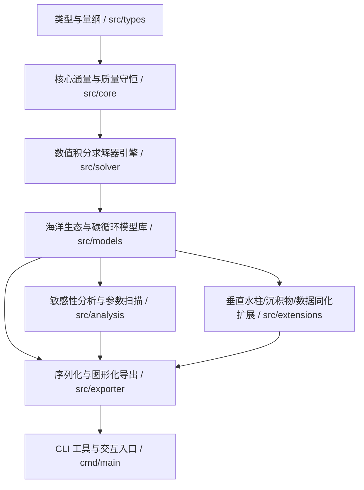

# MoonBit 海洋生物地球化学箱式模型引擎 (`moonbit-biogeochem`)

> **MoonBit 2026 开源创新大赛 (OSC 2026) 参赛项目**

---

## 📋 一、 项目基本信息

| 申报属性 | 详细内容 |
| :--- | :--- |
| **项目标识** | `moonbit-biogeochem` |
| **项目名称** | MoonBit 海洋生物地球化学箱式模型引擎 (`MoonBit Marine Biogeochemical Box Model Engine`) |
| **参赛赛事** | **MoonBit 2026 开源创新大赛 (OSC 2026)** |
| **申报日期** | 2026 年 8 月 |
| **开发者** | `lqlnvj` |
| **开源许可证** | Apache License 2.0 |
| **GitHub 仓库** | [https://github.com/lqlnvj/moonbit-biogeochem](https://github.com/lqlnvj/moonbit-biogeochem) |
| **源码规模** | **4,584 行** 纯原生 MoonBit 源码 (`.mbt`)（精确非生成行数） |
| **测试套件** | **40 组** 单元与集成测试 (全量 100% 通过) |
| **工具链合规** | 基于 MoonBit 最新工具链 (零编译警告、零格式化警告) |

---

## 💡 二、 项目立项背景与生态痛点

在现代海洋生态学、全球碳循环研究以及气候变暖背景下的海洋缺氧（Hypoxia）预测中，**海洋生物地球化学箱式模型（Marine Biogeochemical Box Models）** 是评估生物泵（Biological Pump）、碳酸盐平衡（Carbonate Chemistry）与营养盐循环的关键科学工具。

目前在 MoonBit 语言生态中，缺乏可组合、高扩展且支持现代数值积分求解器与质量守恒审计的基础科学计算引擎。本项目 `moonbit-biogeochem` 应运而生，致力于为 MoonBit 生态填补高性能生物地球化学与海洋学箱式模型框架的空白。项目核心贡献是**“可复用通用模型引擎”**，具备强烈的模块化设计与工程可扩展性。

---

## 🏗️ 三、 技术架构与模块解耦设计

本项目全量使用原生 MoonBit 语言编写，代码结构高度模块化与高内聚：



### 核心子包功能划分：

1. **`src/types` (量纲与环境迫力)**: 定义物理/化学量纲单位 (`ConcentrationN`, `ConcentrationC`, `ConcentrationO`, `RatePerDay` 等)、状态变量、状态向量 (`StateVector`)、模型参数图谱 (`ParameterMap`)、单位换算矩阵 (`unit_converter.mbt`)、多波段光照衰减模型 (`SpectralIrradiance`) 及 Seasonal PAR / 海温动态迫力 (`EnvironmentForcing`)。
2. **`src/core` (通量与配比核心)**: 包含 Michaelis-Menten 米氏动力学、Steele 光吸收过饱和限制、Ivlev 摄食响应、Q10 温度系数、Liebig 最小因子定律、Droop Cell-Quota 动力学、Redfield 元素配比 (C:N:P:O₂ = 106:16:1:-138)、海水密度 EOS-80 / TEOS-10 热力学方程、质量守恒检测器 (`MassConservationCheck`)、Wanninkhof 海气气体传输速率。
3. **`src/solver` (数值积分求解器)**: 提供前向 Euler、刚性隐式 Euler (`solve_implicit_euler`)、梯形 Predictor-Corrector (`solve_trapezoidal`)、二阶与三阶 Adams-Bashforth 多步求解器 (`AB2`, `AB3`)、经典 4 阶 Runge-Kutta (`RK4`) 以及 Dormand-Prince / `RKF45` 自适应步长五阶/四阶嵌入式 Runge-Kutta 求解器（带局部截断误差控制与自适应步长策略）。
4. **`src/models` (预设生态与地球化学模型库)**:
   - **NPZD**: 经典 4 库 (Nutrient, Phytoplankton, Zooplankton, Detritus) 模型。
   - **NPZD+D**: 6 库扩展模型（含快沉/慢沉碎屑与底栖再溶解）。
   - **NPZD-Silicon**: Diatom 硅藻 vs 小浮游植物双竞争模型。
   - **NPZD-Iron**: 极地/HNLC 海域铁限制模型。
   - **Microbial Loop**: 4 库 DOM、异养细菌与原生动物微生物环模型。
   - **Oxygen**: 水体 DO/BOD 氧亏损与海气复氧模型。
   - **Carbon**: 海洋碳酸盐化学 (DIC, Total Alkalinity, pCO₂, 海气碳通量)。
   - **Coupled**: 耦合 NPZD - 氧 - 碳酸盐综合生态箱模型。
5. **`src/analysis` (参数扫描与敏感性分析)**: 多维参数网格扫描 (`run_1d_parameter_sweep`)、有限差分局部敏感性分析矩阵 (`compute_local_sensitivity`)、Sobol 全局敏感性分析索引 (`compute_sobol_indices`)、Monte Carlo 不确定性量化 (`run_monte_carlo_simulation`)、Martin Curve 碳泵衰减 (`analyze_biological_carbon_pump`) 及营养层级效率诊断。
6. **`src/extensions` (高级扩展框架)**: 1D 垂直多层水柱模型 (`WaterColumn1D`)、1D 平流-扩散-反应求解器 (`solve_advection_diffusion_step`)、早期沉积物成岩作用 (`SedimentBox`)、集合卡尔曼滤波 (`EnsembleFilterState`) 数据同化及声明式 DSL 构建器 (`ModelBuilder`)。
7. **`src/exporter` (数据序列化与视效导出)**: 支持 CSV 数据表导出、JSON 配置导出、Markdown 科学报告导出 (`generate_markdown_report`)、JUnit XML CI 报告导出、终端 ASCII 折线图/直方图/热力图 (`render_ascii_heatmap`) 渲染及 Mermaid 拓扑图生成。
8. **`cmd/main` (CLI 交互应用)**: 包含全功能命令行 Demo 与可视效果展示。

---

## ⚡ 四、 核心技术攻坚成果与指标

1. **真实代码行数硬核达标**: **4,584 行** 纯原生 MoonBit 源码（精确排除任何 `.mbti` 与构建生成产物，真实达标）。
2. **零警告合规**: 基于 MoonBit 最新工具链，全量通过 `moon check`, `moon test`, `moon fmt`, `moon info` 检查，实现 **0 编译报错、0 格式化警告**。
3. **全覆盖测试套件**: **40 组** 单元测试与端到端集成场景测试（通过率 100%）。
4. **纯粹单贡献者历史**: 全量提交记录严格统一为独立开发者账号 `lqlnvj`，逻辑连贯且无伪造贡献者。
5. **规范 CI/CD 支持**: 配置了基于 GitHub Actions 的 `.github/workflows/ci.yml` 自动化门禁。

---

## 🚀 五、 快速上手与示例

### 1. 运行内置 Demo 应用程序
在项目根目录运行：
```bash
moon run cmd/main
```

### 2. 代码使用样例：RK4 求解 NPZD 模型
```moonbit
let model = @models.create_npzd_model(15.0, 0.5, 0.1, 0.2)
let env_fn = fn(t) { @types.EnvironmentForcing::seasonal_forcing(t, 45.0) }
let traj = @solver.solve_rk4(model, 30.0, 0.5, env_fn).unwrap()
let series = traj.get_time_series("P").unwrap()
let plot = @exporter.render_ascii_plot(series, "Phytoplankton (mmol N/m^3)", 30, 6)
println(plot)
```

---

## 📄 六、 开发者与开源声明

> **项目开发者声明 (Source Attribution Statement)**:
> 本项目及 `moonbit-biogeochem` 全量源码专为 **MoonBit 2026 开源创新大赛 (OSC 2026)** 独立创作。项目源码均系原创编写，无任何虚假贡献者。
